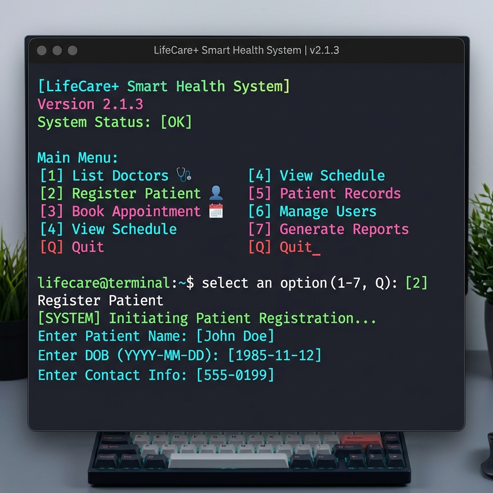

# LifeCare+ Smart Health System

LifeCare+ is a modern, console-based Smart Health System for managing doctors, patients, and hospital appointments. 



## Features
- **Data Persistence**: Uses `hospital_data.json` to safely store all added records (doctors, patients, appointments) across sessions.
- **Robust Error Handling**: Prevents the application from crashing upon invalid input.
- **Health Score System**: Patients maintain a health score that goes up when booking appointments and drops if appointments are cancelled.
- **Terminal Polish**: Styled console outputs utilizing vibrant ANSI escape codes.

## Requirements
- Python 3.x

## How to Run
1. Clone the repository.
2. Navigate into the project folder.
3. Run the script:
   ```bash
   python smartcare.py
   ```
4. Follow the interactive console menu to add doctors, register patients, and book appointments!
